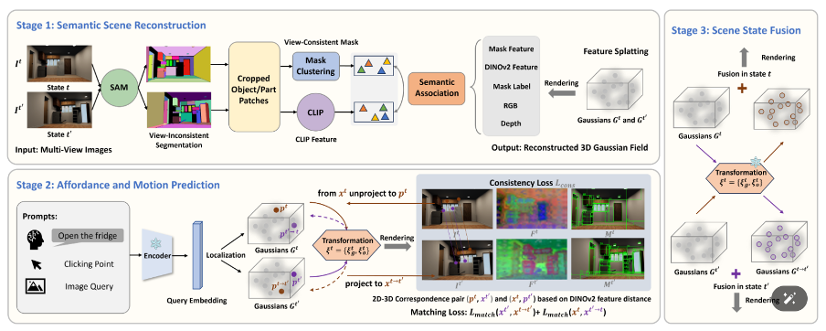

# IAAO: Interactive Affordance Learning for Articulated Objects in 3D Environments

## Abstract
This work presents IAAO, a novel framework that builds an explicit 3D model for intelligent agents to gain understanding of articulated objects in their environment through interaction. Unlike prior methods that rely on task-specific networks and assumptions about movable parts, our IAAO leverages large foundation models to estimate interactive affordances and part articulations in three stages. We first build hierarchical features and label fields for each object state using 3D Gaussian Splatting (3DGS) by distilling mask features and view-consistent labels from multi-view images. We then perform object- and part-level queries on the 3D Gaussian primitives to identify static and articulated elements, estimating global transformations and local articulation parameters along with affordances. Finally, scenes from different states are merged and refined based on the estimated transformations, enabling robust affordance-based interaction and manipulation of objects. Experimental results demonstrate the effectiveness of our method.


## Framework



### 1. Preprocessing

- Extract features and masks from multi-view images
- Generate correspondence pairs across mutli-views

### 2. Feature Splatting

### 3. Matching Correspondences 

### 4. Joint State Fusion


## Citation
```
@inproceedings{zhang2025iaao,
  title={IAAO: Interactive Affordance Learning for Articulated Objects in 3D Environments},
  author={Zhang, Can and Lee, Gim Hee},
  booktitle={Proceedings of the Computer Vision and Pattern Recognition Conference},
  pages={12132--12142},
  year={2025}
}
```